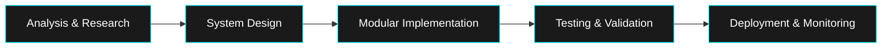
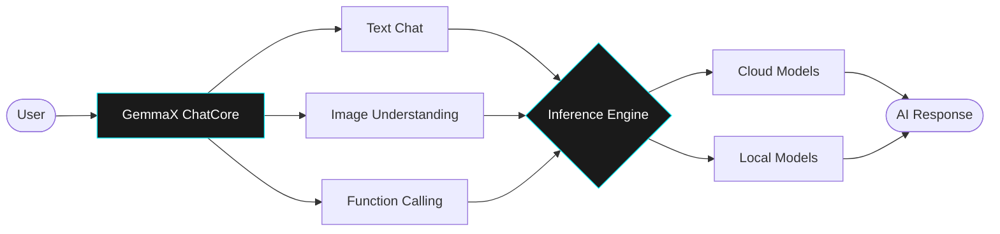

  

  

  
  
  
  

---

## PROFESSIONAL_SUMMARY

> **STATEMENT**: Computer Science undergraduate with interests in **Software Engineering**, **Artificial Intelligence**, and **Aerospace Technology**. Passionate about designing reliable software, understanding intelligent systems, and applying engineering principles to real-world challenges.

### TECHNICAL_OBJECTIVES

- **Algorithms & Problem Solving:** Strengthening foundations in Data Structures, Algorithms, and complexity analysis through consistent practice.
- **Artificial Intelligence:** Exploring machine learning, generative AI, multimodal systems, and real-world AI applications.
- **Software Engineering:** Building reliable, maintainable software while learning system design, clean architecture, and engineering best practices.

---

## ENGINEERING_METHODOLOGY (SDLC)

Standardized approach to software development, ensuring rigorous quality control and maintainability.

---

## TECHNICAL_STACK_&_INSTRUMENTATION

<table width="100%">
  <tr>
    <td width="50%" valign="top">
      <h3>CORE_LANGUAGES</h3>
      
      
    </td>
    <td width="50%" valign="top">
      <h3>AI_&_ML</h3>
      
      
      
      
    </td>
  </tr>
  <tr>
    <td width="50%" valign="top">
<h3>CS_FUNDAMENTALS</h3>

    </td>
    <td width="50%" valign="top">
    <h3>TOOLS</h3>

  

    </td>
  </tr>
</table>

---

## FEATURED_PROJECT: GemmaX ChatCore

**Multimodal Framework for Advanced AI Inference & Experimentation**

### Technical Implementation Details

- **Hybrid Inference:** Supports both cloud-hosted and local model execution through a unified workflow.
- **Multimodal Interaction:** Processes text prompts and image inputs within a single conversational interface.
- **Conversation Memory:** Maintains chat history to enable context-aware multi-turn interactions.

**TECHNOLOGIES:** `Python` `Gemma` `JAX` `Keras Hub` `Google GenAI API`

[**Source Repository →**](https://github.com/ankita-auth/GemmaX_ChatCore)

---

## SYSTEM_METRICS

  

  

---

  <h3>CONTRIBUTION_TIMELINE</h3>
  <picture>
    <source media="(prefers-color-scheme: dark)" srcset="https://raw.githubusercontent.com/ankita-auth/ankita-auth/output/github-contribution-grid-snake-dark.svg" />
    <source media="(prefers-color-scheme: light)" srcset="https://raw.githubusercontent.com/ankita-auth/ankita-auth/output/github-contribution-grid-snake.svg" />
    
  </picture>

---

  <i>
    "When you look at the stars and the galaxy, you feel that you are not just from any particular piece of land, but from the solar system."
  </i>
   
  — Kalpana Chawla

  

